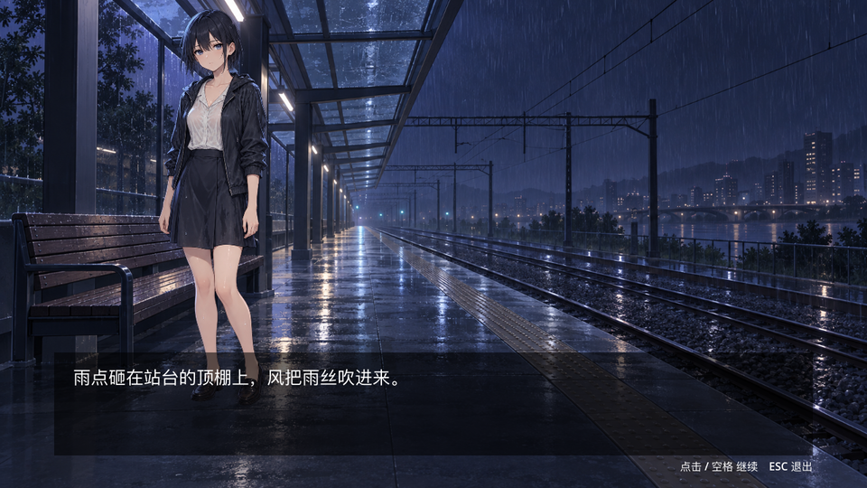

# Godot VNG AI Framework

**A visual-novel (VNG) development framework built for AI Agents.** Agents write code and story scripts, run tests, and fix failures on their own — humans do one thing: play the game and give real feedback.

[中文](README.md) · [Agent Guidelines](AGENTS.md) · [Design Decisions](docs/decision/) · [Demo Game](vng-demo/README.md)



## Why

An agent's iteration loop is only as good as its feedback: **signal quality × speed**. Flaky tests and unlocatable failures push agents to "fix the tests instead of the code". This framework treats *test signals an agent can trust* as the primary design goal:

- **Determinism first**: unified RNG / logical clock / command-based input — same seed reproduces byte-for-byte
- **Locatable failures**: `file:line`, expected/actual values, story node ids, semantic event traces
- **No false green**: zero tests found = exit code 3; runtime-error scanning; `--flake-check` double-run comparison

## Highlights

- **Custom test core** (zero third-party deps): process isolation, soft/hard watchdogs, JSON/JUnit reports, exit-code contract
- **Story DSL (`.vns`)**: compiles to a canonical JSON model; static lint for broken jumps, flag typos, asset/character registration, node reachability — with line numbers and did-you-mean suggestions
- **Playthrough DSL + trace goldens**: semantic event traces (no line numbers or timestamps); updates require explicit approval and are audit-logged
- **Deterministic core**: Rng / Clock / InputHub / EventBus via service injection; core has zero Node dependencies and is unit-testable headless
- **Presentation tests via real input paths**: mouse/keyboard simulation goes through the actual GUI picking and input routing; scene re-entry is covered by regression tests
- **Asset pipeline**: works with zero assets, drop-in effect without re-import; `tools/demo assets` lists what is still missing

## Quick Start

Requirements: **Godot 4.7+** (macOS supported today); set `GODOT_BIN` to point at the executable.

```bash
tools/test --fast          # framework unit tests (seconds)
tools/test                 # full framework suite: 138 tests (unit / meta contracts / story E2E)
tools/demo run             # play the demo game "Rainy Night Station"
tools/demo test            # game-side tests: 15 (story / smoke / asset pipeline)
tools/lint                 # formatting + static checks + non-deterministic API scan
```

## Repository Layout

```
addons/vng_test/   # test framework: runner / assertions / discovery / watchdogs / reporters / DSL / input sim
addons/vns/        # story format: parser / validator / linter / compiler / asset paths & reports
game/              # framework runtime: core (zero Node deps) + services (determinism)
tests/             # framework self-tests: unit / meta contracts / story E2E + trace goldens
tools/             # unified CLIs: test / lint / story / demo
vng-demo/          # demo game project (one-way framework mirror + real art/audio)
docs/              # decision records (ADRs) and plans
```

The framework/game relationship and mirroring mechanism are described in [decision 0003](docs/decision/0003-game-project-structure.md).

## Design Docs

| Document | Content |
| --- | --- |
| [0001 Testing Strategy](docs/decision/0001-testing-strategy-v1.md) | V1 scope, layers and trade-offs |
| [0002 Story DSL](docs/decision/0002-story-dsl.md) | `.vns` syntax, compiled model, lint |
| [0003 Project Structure](docs/decision/0003-game-project-structure.md) | framework/game mirroring and `tools/demo` |
| [0004 Presentation Testing](docs/decision/0004-presentation-testing.md) | input simulation, re-entry tests, engine-error attribution |
| [0005 Asset Pipeline](docs/decision/0005-asset-pipeline.md) | directory conventions, fallback chain, asset reports |
| [AGENTS.md](AGENTS.md) | agent working rules and command contract |
| [Demo Game](vng-demo/README.md) · [Asset Requests](vng-demo/ASSETS.md) | run/acceptance checklist and asset list |

## Status

- First playable slice "Rainy Night Station" is playable: title → scenes → choice branches → END → back to title ([title screen](docs/assets/demo-title.png)); backgrounds and character art delivered, audio pending
- Tests: 138 framework + 15 game tests, all green
- Next candidates: save/load and multi-chapter runtime, audio drop-in, export presets, scene-semantic assertion library

## License

[MIT](LICENSE)
